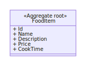
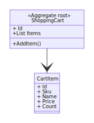
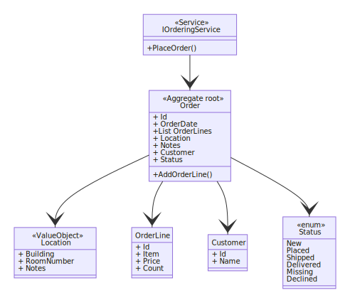
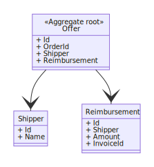
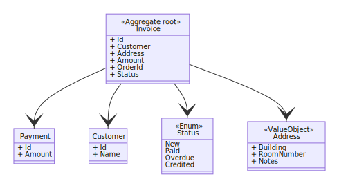
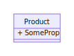

# Lab 3 Domain Driven Design

* Deadline: 20.10.2022
* The lab has to be manually approved by the teaching assistants during lab hour.
  * The student is expected to explain the code during the manually approval.
  * All code has to be submitted before the deadline, but can be approved on the first lab after the deadline.
  * It is possible to get the code approved before the deadline.
* Lab 3 contains very few QuickFeed tests due to the nature of the code.


## Building a food ordering system (Campus eats)

For lab 3 you are going to build the ordering and fulfillment part of the food ordering system which takes and order from a customer and makes it available to a shipper which can bring the order to the customer. It would be a system similar to foodora or wolt. 

### General description

The customer is placing an order for an item from the campus cafeteria or the cafe and a shipper will go and buy the item, bring it to the desired location and received payment from the customer.

## Lab2

Under you can find the diagram we currently have from lab two. It is very basic and does not contain a lot of information. 




## Task

For this lab you are supposed to implement the parts of the diagram which is currently not implemented. Continuous lines are api calls (function calls) from a pipeline to a service, where the service is in another context then the pipeline calling it. An example is that the CartContext pipeline calls the IOrderingService via the interface. Dotted lines are event based messages sent across context boundaries. The products and cart implementation are given as an inspiration for how to implement the rest.


### New class diagram

From the lectures the current diagram was created with some modifications:





## Relations between the different models


### Product Context


### Cart Context





### Ordering Context





### Fulfillment Context





### Invoicing Context





<!---->


### Organizing the code

You should use the same folder structure as found in `Core/Domain/Cart` and `Core/Domain/Products`. Every class, interface, record and enum should be in its own file unless it is part of another class like for instance the pipeline handlers, where the request is defined in the same file as the handler. 

The code should follow the DDD principal learned in the lectures as well as what is already used in the Cart and Products folders. You should use MediatR and the pipelines to handle context requests as shown in the Cart and Products folders. The the domain models is required to be stored in the database so they should be added to the ShopContext.

Folder structure:
```
Domain/
    {Context name}/
        Handlers/
            (Should contain event handlers)
        Pipelines/
            (Should contain Pipeline handlers and requests)
        Events/
            (Should contain the event class)
        Dto/
            (Should contain Data transfer objects)
        Services/
            (Should contain the interface and implementation of domain services)
        (The Domain models should be in the Context folder directly)
```

### Required parts for the lab

1. Create a new event handler for "FoodItemPriceChanged"
   1. Get inspiration from FoodItemNameChangedHandler and FoodItemNameChanged for how to implement it.
   2. This is so that if an item price is updated then also the cart price is updated.
2. Create the ordering context
   1. Create the order aggregated root and related classes as shown in the diagram
   2. Create a new class which implements IOrderingService
      1. This is a class which should have an PlaceOrder method which takes all the information needed to create an order, (Location, CustomerName, CartItems)
   3. Create a new Pipeline for CartCheckout (in the Cart context) which retrieves a cart and inserts it into the IOrderingService to create an order
      1. The current cart should be closed and removed from the session after it is placed.
   4. Update the UI to be able to place an order
      1. This ui has to contain the following information for placing the order
         1. Building
         2. Room number
         3. Location Notes
         4. Customer Name
      2. These are also the fields that the IOrderingService requires for creating an order
   5. Verify that it is possible to place and order
   6. Create an order overview for all placed orders
   7. Create a details page which can display details for an order, this page should be reached from the order overview page.
      1. This page should also request the Offer and Invoice information from the respective contexts and display them if they are implemented and available.
3. Create the Fulfillment context
   1. Create the Offer aggregated root and related classes as shown in the diagram
   2. When an OrderPlaced event is raised then a handler in the fulfillment context should create an empty offer
      1. The Reimbursement should be created without InvoiceId and Shipper with only the sum of the order specified.
      2. The Shipper should be null when the offer is created
   3. Update the order details page with a form which accepts a Shipper name as input
      1. This should only be displayed if the status of the order is Placed
      2. When submitted the page should send a message to the fulfillment pipeline which assigns the shipper to the offer.
      3. This should trigger an event which marks the order as sent.
         1. The event handler should be in the Ordering context
4. Create the Invoice context
   1. Create the Invoice Aggregated root and related classes as shown in the diagram
   2. When an OrderPlaced event is raised then a handler in the Invoice context should create an invoice and related classes
5. There should not be a way to construct an object without having to set required fields
   1. Look at ShoppingCart, CartItem and FoodItem for inspiration. 
   2. We will tolerate if not all items is created this way, but try as best as possible.


### New PriceChanged event handler

The first task is to create a new event handler for when a product price is updated. This should update all the prices in the shopping carts which is not completed yet, so that the customer see the updated price, instead of the price when the item was added to the cart.

### The ordering context

The OrderingContext should contain data and logic for handling everything about creating the order.

### The fulfillment context

The fulfillment context should contain data and logic for handling the order after the order context has created the order. This includes ability to set a shipper for the food item, as well as sending updates to the ordering context that someone has started working on the order.

### The invoice context

The invoice context should contain data and logic related to payment of the order. After the order is created this should handle things like sending the invoice to the customer as well as handling the payment information. In this lab, we will only create the invoice and display it as described in the task points at the top.

### Value objects and EF Core

This link describes how to define an object as an value object (Owned entity) in entity framework. [https://docs.microsoft.com/en-us/ef/core/modeling/owned-entities](https://docs.microsoft.com/en-us/ef/core/modeling/owned-entities).

### Tips

Look at how things are implemented in Cart and Product Context. To get the extra information needed for the order, you could create a form on the checkout page, like Product have a create new food item. Use the code already there, and the code created in lab2 to get inspiration for how to do this lab.

Also try and find the code for the different objects from the product and cart context shown in the diagrams. The cart and product context models have already been created, and see how the fields from the code match up with the diagram. 

### OrderService.PlaceOrder

The place order in ordering service should do the following:

1. Retrieve the customer from the database by name, look at the GetById pipeline for inspiration for how to retrieve entries.
   1. It should be retrieved by name (customerName)
2. If the returned object is null, then assign a new customer to the variable, add it to the database and use that customer instead.
3. Create a `new Order`
   1. Assign the Location, and Customer to the order
   2. Loop through all the OrderLineDtos and add them to the `order.AddOrderLine` method.
   3. The `order.AddOrderLine` method should add the orderline to a list in the Order.
4. Add the order to the database and save changes
5. Update the status of the Order to placed and make sure that the OrderPlaced event is added to the `order.event` list. This 
6. Save the new changes to the database

### Approval script

1. Start application
2. Add item to cart
   1. Change name, the cart should be updated
   2. Change price, the cart should be updated
3. Checkout cart with
   * Building
   * Room number
   * location notes
   * Customer name
4. Display all orders (Status for the new order should be placed)
   1. Go to details for the order
      * All information for the order should be exposed
        * Id, status, date, customer, location, items, offer, invoice
   2. Take the order with a name
      * The order should now have status Shipped
      * The offer now include information about the shipper
   3. The overview should also display the order as shipped
5. Show the code for Price change
6. Show place order pipeline
7. Show code for place order service
8. Show the event handlers for OrderPlaced
9. Show pipeline for Set shipper
10. Show the event handler for OfferShipperSet
